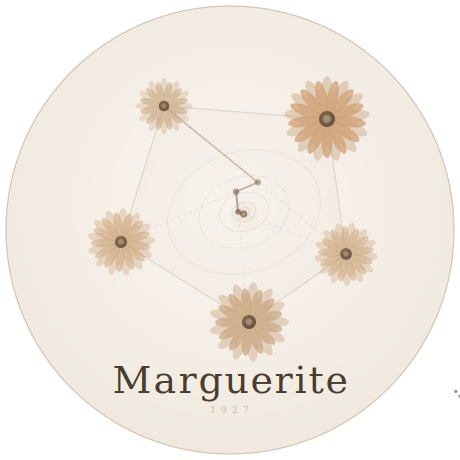

<p align="center">
  
</p>

# Marguerite.jl

*A minimal, performant, and differentiable Frank-Wolfe solver.*

Named after **Marguerite Frank** (1927--), co-inventor of the Frank-Wolfe algorithm (1956). An often-forgotten woman in optimization from an era when that was extraordinarily rare. Also a flower, fitting Julia's botanical naming tradition.

[](https://samtalki.github.io/Marguerite.jl/stable/)
[](https://samtalki.github.io/Marguerite.jl/dev/)
[](https://github.com/samtalki/Marguerite.jl/actions/workflows/CI.yml?query=branch%3Amain)

**[Documentation](https://samueltalkington.com/research/marguerite/)**

## The Algorithm

The **Frank-Wolfe** (conditional gradient) method solves

$$\min_{x \in \mathcal{C}} f(x)$$

where $\mathcal{C}$ is a compact convex set accessed only through a **linear minimization oracle** (LMO):

$$v_t = \arg\min_{v \in \mathcal{C}} \langle \nabla f(x_t), v \rangle$$

Each iteration updates $x_{t+1} = x_t + \gamma_t (v_t - x_t)$ with step size $\gamma_t = 2/(t+2)$, yielding $O(1/t)$ convergence for generalized self-concordant objectives.

## Quick Start

```julia
using Marguerite, LinearAlgebra

Q = [2.0 0.5; 0.5 1.0]; c = [-1.0, -0.5]
f(x) = 0.5 * dot(x, Q * x) + dot(c, x)
∇f!(g, x) = (g .= Q * x .+ c)

x, result = solve(f, ∇f!, ProbabilitySimplex(), [0.5, 0.5])
```

## Features

### One function, four signatures

```julia
# Manual gradient:
x, result = solve(f, ∇f!, lmo, x0; max_iters=1000, tol=1e-7)

# Auto gradient (Mooncake default, zero ceremony):
x, result = solve(f, lmo, x0)

# Parameterized (differentiable):
x, result = solve(f, ∇f!, lmo, x0, θ)

# Auto gradient + differentiable:
x, result = solve(f, lmo, x0, θ)
```

### Five built-in oracles

| Oracle | Constraint Set | Complexity |
|--------|---------------|------------|
| `Simplex(r)` | $x \geq 0, \sum x_i \leq r$ | $O(n)$ |
| `ProbSimplex(r)` | $x \geq 0, \sum x_i = r$ | $O(n)$ |
| `Knapsack(q, backbone, m)` | $x \in [0,1]^m, \sum x_i \leq q$, backbone fixed | $O(m \log k)$ |
| `Box(lb, ub)` | $\ell_i \leq x_i \leq u_i$ | $O(n)$ |
| `WeightedSimplex(α, β, lb)` | $x \geq \ell, \alpha^\top x \leq \beta$ | $O(m)$ |

Any callable `(v, g) -> v` also works as an oracle -- no subtyping required.

### Implicit differentiation

When parameters `θ` are passed, a `ChainRulesCore.rrule` computes $\partial x^* / \partial \theta$ via implicit differentiation:

$$\bar{\theta} = -\left(\frac{\partial \nabla_x f}{\partial \theta}\right)^\top u, \quad [\nabla^2_{xx} f + \lambda I]\, u = \bar{x}$$

The Hessian system is solved by conjugate gradient with Hessian-vector products (no explicit Hessian).

### Bilevel optimization

The differentiable `solve` enables bilevel optimization -- learning parameters of constrained problems by backpropagating through the solver. No unrolling. O(1) memory. Exact gradients.

```julia
using ChainRulesCore: rrule

# Inner: x*(θ) = argmin_{x ∈ C} f(x, θ)
(x_star, result), pb = rrule(solve, f, ∇f!, lmo, x0, θ; max_iters=5000)

# Outer: backpropagate loss gradient through solve
tangents = pb((∇loss(x_star), nothing))
θ̄ = tangents[end]  # ∂loss/∂θ
θ .-= η .* θ̄       # gradient step
```

## Comparison with FrankWolfe.jl

| Aspect | FrankWolfe.jl | Marguerite.jl |
|--------|--------------|---------------|
| Oracle interface | `compute_extreme_point(lmo, dir)` | `lmo(v, g)` -- callable, in-place |
| Oracle requirement | Must subtype abstract type | Any callable works |
| Entry point | 8 algorithm functions | `solve()` |
| Gradient | Always user-supplied | Optional (auto via Mooncake default) |
| Differentiable | No | Yes (rrule on `solve`) |
| Memory | `memory_mode` parameter | Always in-place, `Cache` pattern |

## Installation

```julia
using Pkg
Pkg.add(url="https://github.com/samtalki/Marguerite.jl")
```

## References

- M. Frank & P. Wolfe, "An algorithm for quadratic programming," *Naval Research Logistics*, 1956.
- S. Carderera, M. Besançon & S. Pokutta, "Scalable Frank-Wolfe on Generalized Self-concordant Functions via Simple Steps," 2024.
- S. Lacoste-Julien & M. Jaggi, "On the Global Linear Convergence of Frank-Wolfe Optimization Variants," 2015.
- A. Palmieri, M. Rinaldi & F. Salzo, "On the Use of the Frank-Wolfe Algorithm for Bilevel Optimization," 2024.
