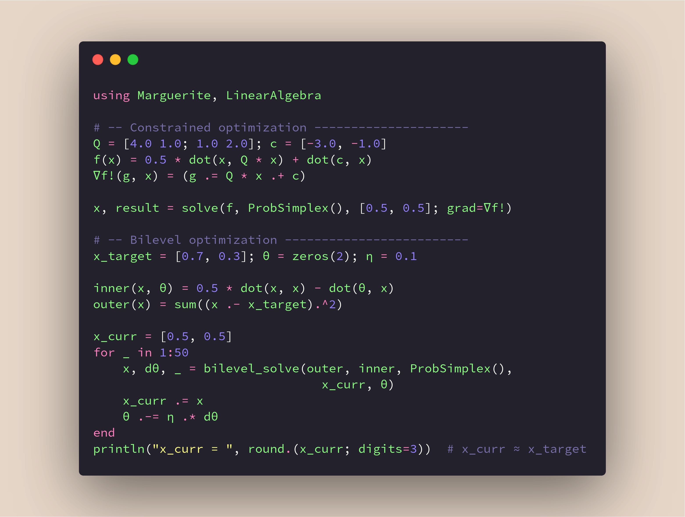

<p align="center">
  
</p>

# Marguerite.jl

A minimal, differentiable Frank-Wolfe solver for constrained convex optimization in Julia.

Named in honor of [Marguerite Frank](https://en.wikipedia.org/wiki/Marguerite_Frank) (1927--2024), co-inventor of the Frank-Wolfe algorithm (1956).

[](https://samueltalkington.com/research/marguerite/)
[](https://github.com/samtalki/Marguerite.jl/actions/workflows/CI.yml?query=branch%3Amain)
[](https://julialang.org/)
[](LICENSE)

Finds parameterized solutions to constrained convex programs of the form

$$
x_\star(\theta) \in \arg\!\min_{x \in \mathcal{C}(\theta)}\, f(x;\theta),
$$

where $\mathcal{C}(\theta)$ is a compact convex set parameterized by $\theta$, accessed via a **linear minimization oracle** (LMO). The LMO returns solutions to the linear subproblem

$$
v_\star(\theta) \in \arg\!\min_{v \in \mathcal{C}(\theta)} \ \langle \nabla f, v \rangle.
$$

## Scalable bilevel programming

`Marguerite.jl` is built for **simple and fast bilevel optimization**, meaning optimization programs that appear as

$$
\begin{align*}
\min_{\theta \in \Theta} &\ u(x_\star(\theta)) \\
\mathsf{s.t.} \quad &\ x_\star(\theta) \in \arg\!\min_{x \in \mathcal{C}(\theta)}\, f(x;\theta).
\end{align*}
$$

Marguerite implements optimized implicit differentiation methods for a class of LMOs, enabling simple and easy bilevel optimization. Although there is more work to be done, Marguerite already provides convenient solutions for a variety of useful problems through a minimalist and user-friendly interface.

## Quick Start

<p align="center">
  
</p>

```julia
using Marguerite, LinearAlgebra

# -- Constrained optimization ---------------------
Q = [4.0 1.0; 1.0 2.0]; c = [-3.0, -1.0]
f(x) = 0.5 * dot(x, Q * x) + dot(c, x)
∇f!(g, x) = (g .= Q * x .+ c)

x, result = solve(f, ProbSimplex(), [0.5, 0.5]; grad=∇f!)

# -- Bilevel optimization -------------------------
x_target = [0.7, 0.3]; θ = zeros(2); η = 0.1

inner(x, θ) = 0.5 * dot(x, x) - dot(θ, x)
outer(x) = sum((x .- x_target).^2)

x_curr = [0.5, 0.5]
for _ in 1:50
    x, dθ, _ = bilevel_solve(outer, inner, ProbSimplex(),
                               x_curr, θ)
    x_curr .= x
    θ .-= η .* dθ
end
println("x_curr = ", round.(x_curr; digits=3))  # x_curr ≈ x_target
```

Omit `grad=` for automatic differentiation via [ForwardDiff](https://github.com/JuliaDiff/ForwardDiff.jl).

## Why `Marguerite.jl`?

### When to use Marguerite

- You have a constrained convex problem and a **linear minimization oracle** (LMO) for the constraint set
- You want **differentiable optimization** -- gradients through the solver via implicit differentiation
- You need **projection-free** optimization (simplex, knapsack, matroid, flow polytopes, etc.)
- You want **bilevel optimization** with constrained inner problems
- You value a simple, minimal API with zero-allocation inner loops

### Features

- Single entry point: `solve(f, lmo, x0; grad=∇f!, ...)`, with or without automatic gradients and differentiable parameters
- Pre-allocated buffers for allocation-free inner loops (`@inbounds` hot paths)
- Six built-in oracles: simplex, probability simplex, knapsack, masked knapsack, box, weighted simplex
- Custom oracles: any `(v, g) -> v` callable, or subtype `AbstractOracle` for specialized dispatch
- Differentiable solve via `ChainRulesCore.rrule` for $\partial x^* / \partial \theta$ (implicit differentiation)
- Bilevel optimization: `bilevel_solve` backpropagates through the solver to learn parameters of constrained problems

### See also

Other great packages in the Frank-Wolfe ecosystem:

- [FrankWolfe.jl](https://github.com/ZIB-IOL/FrankWolfe.jl) — comprehensive Frank-Wolfe toolbox by Besançon, Pokutta et al.
- [DifferentiableFrankWolfe.jl](https://github.com/JuliaDecisionFocusedLearning/DifferentiableFrankWolfe.jl) — differentiable wrapper for FrankWolfe.jl

### Documentation

See the [full documentation](https://samueltalkington.com/research/marguerite/) for tutorials, examples, and API reference.

### Installation

Requires Julia 1.12+. Install directly from the repository:

```julia
using Pkg
Pkg.add(url="https://github.com/samtalki/Marguerite.jl")
```

## Citing

If you use Marguerite.jl in your research, please cite:

```bibtex
@software{talkington2026marguerite,
  author  = {Talkington, Samuel},
  title   = {Marguerite.jl: A Minimal, Differentiable Frank-Wolfe Solver},
  year    = {2026},
  url     = {https://github.com/samtalki/Marguerite.jl},
  version = {0.1.0}
}
```

## References

- M. Frank & P. Wolfe, ["An algorithm for quadratic programming,"](https://doi.org/10.1002/nav.3800030109) *Naval Research Logistics*, 1956.
- A. Carderera, M. Besançon & S. Pokutta, ["Scalable Frank-Wolfe on Generalized Self-concordant Functions via Simple Steps,"](https://arxiv.org/abs/2105.13913) *SIAM J. Optim.*, 2024.
- S. Lacoste-Julien & M. Jaggi, ["On the Global Linear Convergence of Frank-Wolfe Optimization Variants,"](https://arxiv.org/abs/1511.05932) *NeurIPS*, 2015.
- A. Palmieri, F. Rinaldi, S. Salzo & S. Venturini, ["Iteration Complexity of Frank-Wolfe and Its Variants for Bilevel Optimization,"](https://arxiv.org/abs/2602.23076) 2026.
