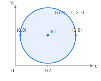

<!-- Copyright 2026 Samuel Talkington
   SPDX-License-Identifier: Apache-2.0 -->


# Oracles

All oracles solve the linear minimization problem

```math
v^* = \arg\min_{v \in \mathcal{C}} \langle g, v \rangle
```

in-place via `lmo(v, g)`. Any callable `(v, g) -> v` works as an oracle — plain functions
are auto-wrapped by `solve`. Subtype `AbstractOracle` for specialized dispatch
(e.g. `active_set`, sparse vertex protocol).
See the [Tutorial](@ref) for an example of writing a custom oracle.

```@docs
AbstractOracle
FunctionOracle
```

## Simplex


```@docs
Simplex
ProbSimplex
ProbabilitySimplex
```

## Knapsack


```@docs
Knapsack
```

## MaskedKnapsack


```@docs
MaskedKnapsack
```

## Box


```@docs
Box
```

## ScalarBox

`ScalarBox` is a memory-efficient alternative to `Box` when all lower bounds
are the same scalar and all upper bounds are the same scalar. Use the
convenience constructor `Box(lb, ub)` with scalar arguments:

```julia
lmo = Box(0.0, 1.0)  # equivalent to ScalarBox{Float64}(0.0, 1.0)
```

```@docs
ScalarBox
```

## WeightedSimplex


```@docs
WeightedSimplex
```

## Spectraplex



The spectraplex is the natural constraint set for semidefinite programming (SDP)
relaxations. The solver operates on `vec(X)` (the column-major vectorization of
the matrix variable), and the oracle computes the minimum eigenvector to produce
a rank-1 vertex. The trace radius must be nonnegative.

Convenience: `Spectraplex(n)` gives the unit spectraplex (``r = 1``).

```@docs
Spectraplex
```

## Active Set Identification

At a solution ``x^*``, Marguerite identifies which constraints are active
(binding) to support KKT adjoint differentiation. Each oracle type has a
specialized [`active_set`](@ref) method.

For custom oracles, this specialization is optional for primal solves but
required for differentiated solves unless you pass `assume_interior=true`
explicitly.

```@docs
ActiveConstraints
active_set
```
