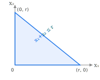
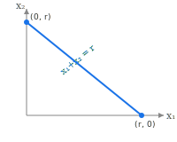
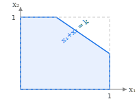
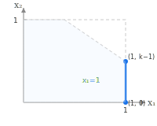
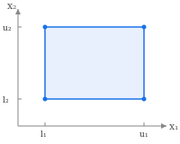
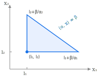

<!-- Copyright 2026 Samuel Talkington and contributors
   SPDX-License-Identifier: Apache-2.0 -->

# Oracles

All oracles solve the linear minimization problem

```math
v^* = \arg\min_{v \in \mathcal{C}} \langle g, v \rangle
```

in-place via `lmo(v, g)`. Any callable `(v, g) -> v` works as an oracle.
See the [Tutorial](@ref) for an example of writing a custom oracle.

```@docs
AbstractOracle
```

## Simplex





```@docs
Simplex
ProbSimplex
ProbabilitySimplex
```

## Knapsack



```@docs
Knapsack
```

## MaskedKnapsack



```@docs
MaskedKnapsack
```

## Box



```@docs
Box
```

## WeightedSimplex



```@docs
WeightedSimplex
```
